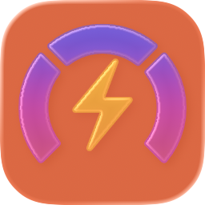
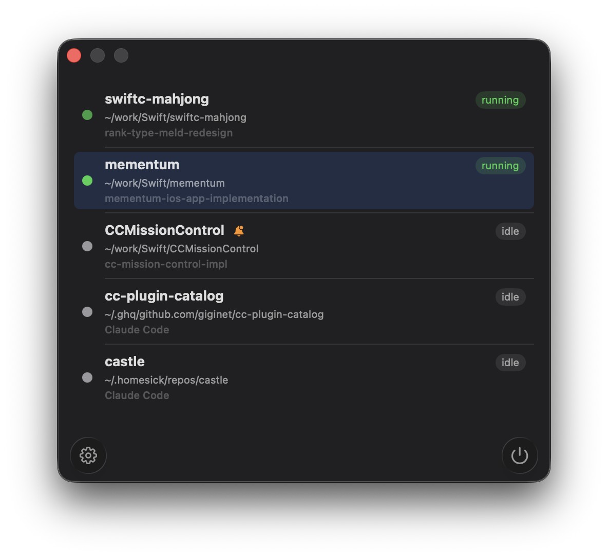

# CCMissionControl



[](https://developer.apple.com/macos/)
[](https://swift.org/)
[](https://wezfurlong.org/wezterm/)
[](https://github.com/giginet/CCMissionControl/actions/workflows/test.yml)
[](LICENSE)
[](https://github.com/giginet/CCMissionControl/releases/latest)

A macOS menu bar app that monitors running [Claude Code](https://docs.anthropic.com/en/docs/claude-code) sessions in [WezTerm](https://wezfurlong.org/wezterm/).

## Features



- Detects Claude Code sessions by cross-referencing WezTerm panes with system processes
- Shows running/idle status based on `caffeinate` child process detection
- Menu bar indicator with session count and activity status
- Unread notification badge when a session completes while you're on another tab
- Click a session to switch to its WezTerm tab
- Auto-clears notifications when you return to the tab

## Requirements

- macOS 26.0+
- [WezTerm](https://wezfurlong.org/wezterm/) installed at `/Applications/WezTerm.app`
- [Claude Code](https://docs.anthropic.com/en/docs/claude-code) running in WezTerm

## Build

```bash
xcodebuild -scheme CCMissionControl -configuration Debug build
```

## How it works

The app periodically (every 2 seconds) runs:

1. `wezterm cli list --format json` to discover terminal panes
2. `wezterm cli list-clients --format json` to determine the focused pane
3. `ps -eo pid,ppid,tty,comm` to inspect the process tree

It matches WezTerm panes to Claude Code processes by normalizing TTY names and walking the process ancestor chain. A Claude Code session is considered "running" if it has a `caffeinate` child process.

## Menu bar icons

| Icon | Meaning |
|------|---------|
| `bolt.fill` + N | N sessions actively running |
| `powersleep` + N | All N sessions idle |
| `bell.badge.fill` | A session completed while you were on another tab |

## Acknowledgments

Inspired by [wez-cc-viewer](https://github.com/sorafujitani/wez-cc-viewer).
