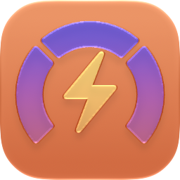
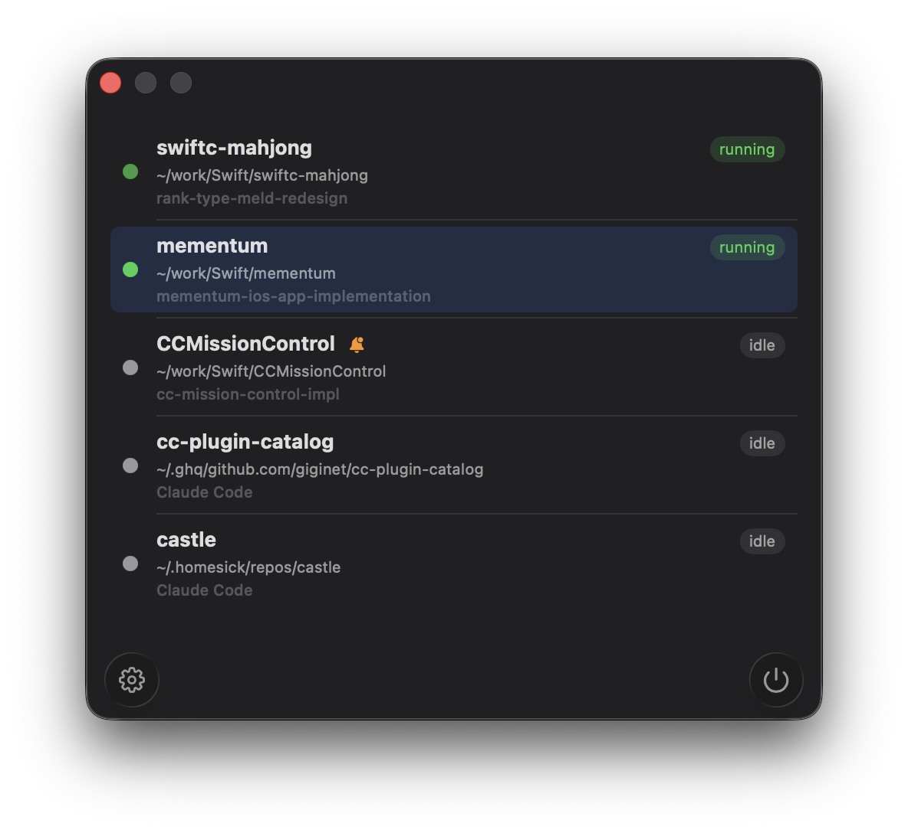

# CCMissionControl

[](https://developer.apple.com/macos/)
[](https://swift.org/)
[](https://wezfurlong.org/wezterm/)
[](https://github.com/giginet/CCMissionControl/actions/workflows/test.yml)
[](LICENSE)
[](https://github.com/giginet/CCMissionControl/releases/latest)



A macOS menu bar app that monitors [Claude Code](https://docs.anthropic.com/en/docs/claude-code) and [Codex CLI](https://developers.openai.com/codex/cli) sessions in [WezTerm](https://wezfurlong.org/wezterm/).

## Features



- Detects Claude Code and Codex CLI sessions via WezTerm CLI and process tree inspection
- Color-coded agent badges: blue for **Codex**, orange for **Claude**
- Menu bar icon showing session count and activity status, including unknown activity
- macOS notifications and unread badges when a known running session becomes idle in the background
- Click to switch to the agent's WezTerm tab and pane, auto-clear unread badges on focus return
- Dropdown and floating window modes
- Settings: notifications, Launch at Login, custom WezTerm path

## Requirements

- macOS 26.0+
- [WezTerm](https://wezfurlong.org/wezterm/) installed at `/Applications/WezTerm.app`
- Claude Code or Codex CLI running in WezTerm

## Supported agents

| Agent | Badge | Session detection and pane switching | Activity status | Completion notifications |
|-------|-------|--------------------------------------|-----------------|--------------------------|
| Claude Code | Orange `Claude` | Supported | Running / idle | Supported |
| Codex CLI | Blue `Codex` | Supported | Running / idle / waiting, inferred from terminal title | On a detected running → idle transition |

Both agents can be listed together across WezTerm panes. Codex support covers interactive CLI sessions, including `resume` and `fork`. Non-interactive commands, server processes, and helper processes are excluded. Desktop/IDE sessions without a matching WezTerm TTY are not listed.

## Download

Download the latest release from [GitHub Releases](https://github.com/giginet/CCMissionControl/releases/latest).

## Build

```bash
xcodebuild -scheme CCMissionControl -configuration Debug build
```

## How it works

The app periodically (every 2 seconds) runs:

1. `wezterm cli list --format json` to discover terminal panes
2. `wezterm cli list-clients --format json` to determine the focused pane
3. `ps -eo pid,ppid,tty,comm` to inspect the process tree

It matches WezTerm panes to agent processes by normalizing TTY names and walking the process ancestor chain. A Claude Code session is considered "running" if it has a `caffeinate` child process.

Claude Code and Codex implement a shared `AgentDetector` interface. Codex detection matches the native `codex` executable and reads its argument vector using macOS `KERN_PROCARGS2` to exclude non-interactive commands and servers. npm's Node launcher is represented by its native Codex child. If arguments cannot be read, or an option is unrecognized, that candidate is skipped. One outer agent session is shown per pane; unrelated sessions on the same TTY use the lowest PID as a stable tie-breaker.

Codex activity is inferred from the raw WezTerm pane title, using title formats from Codex CLI 0.153.4:

| Leading title item | Activity |
|--------------------|----------|
| `Working`, `Thinking`, or a recognized braille spinner | `running` |
| `Ready` | `idle` |
| `[ ! ] Action Required` or `[ . ] Action Required` | `waiting` (approval or input needed) |
| Plain project name matching the pane’s working directory name | `idle` (default title format) |
| Other unrecognized titles | `unknown` |

Text status items must be first and either stand alone or be followed by ` | ` and the other title items. Title parsing is a heuristic: custom titles, terminal overrides, and future Codex versions can make status unavailable or inaccurate. A plain title is treated as idle only when it matches the working directory name of a confirmed Codex pane. A custom title that always shows only the project name can therefore be misclassified; use an explicit status title for clearer detection.

### Codex title configuration

For explicit idle and running status, add or update this setting in your Codex `config.toml` (normally `~/.codex/config.toml`), then restart the CLI session:

```toml
[tui]
terminal_title = ["status", "project"]
```

Merge this into an existing `[tui]` section if present. CCMissionControl does not change your Codex configuration. Codex's default `["spinner", "project"]` title is supported without configuration when the project title matches the pane’s working directory name. If Codex uses a different project name (for example, a repository root rather than the current subdirectory), the plain title remains `unknown`; the explicit status setting avoids this ambiguity. See the [official title configuration example](https://learn.chatgpt.com/docs/config-file/config-sample).

Only a directly observed `running` → `idle` transition for the same session produces a completion notification. Entering `waiting` or `unknown`, or moving from `waiting` directly to `idle`, does not. Two-second polling may miss short turns. Hooks and App Server state integration are not included.

## Menu bar icons

| Icon | Meaning |
|------|---------|
| `bolt.fill` + N | N sessions actively running (no sessions waiting for input) |
| `exclamationmark.circle` + N | At least one session needs approval or input; N is the total session count |
| `powersleep` + N | All N sessions idle |
| `questionmark.circle` + N | No known running sessions; some activity states are unknown |
| `bell.badge.fill` | A session completed while you were on another tab |

## Acknowledgments

Inspired by [wez-cc-viewer](https://github.com/sorafujitani/wez-cc-viewer).

## License

Apache 2.0 License
